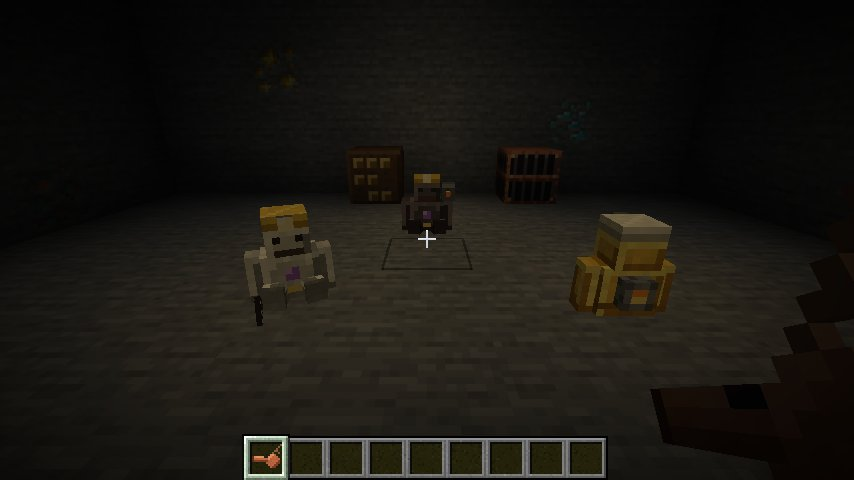
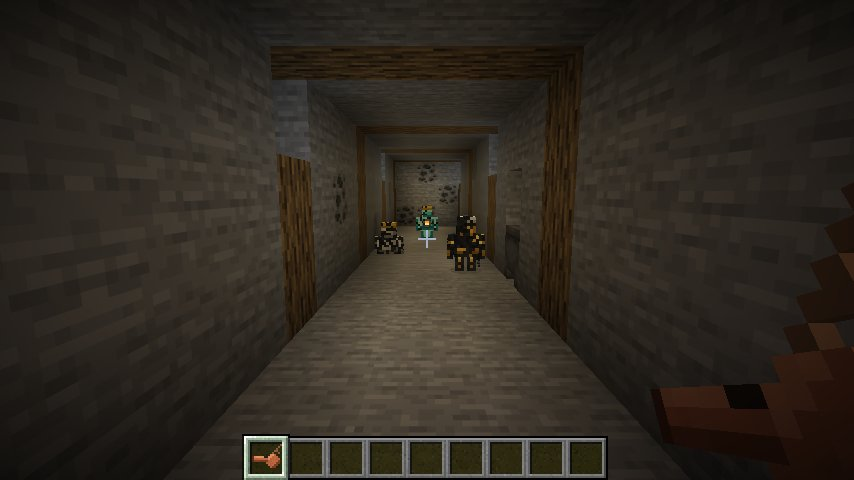

# Kumpel ⛏️

*Glück auf!* A small mining golem that keeps you company underground.
Your Kumpel follows you, picks up loot, senses ores, lights up dark tunnels, warns you about creepers and grows from copper to netherite the more you work together. Give it a pickaxe and it mines for you; give your crew a whistle and a chest and you have your own little colliery.

**Minecraft 26.3 · Fabric Loader ≥ 0.19.5 · Fabric API · Java 25** · optional: JEI or REI


## Getting started

Craft a **Kumpel Core** and use it on a block, and your own Kumpel appears.

```
 . A .      A = Amethyst Shard
 C R C      C = Copper Ingot
 C C C      R = Redstone Dust
```

A Kumpel spawned another way (e.g. `/summon kumpel:kumpel`) can be tamed with a copper ingot.
Everything the mod adds is in its own **Kumpel** creative tab.

## What your Kumpel does

| | |
|---|---|
| **Follows you** | Keeps close and teleports to you if it falls behind. Never takes fall damage, never drowns. |
| **Mitfahrt** | Go through a portal and the Kumpels following you come along. On their own they never use portals, so none of them gets lost in the Nether. |
| **Collects loot** | Picks up dropped items near you and brings them to you (or to its storage chest). Items *you* throw away are left alone. |
| **Senses ores** | Scans the area around it every few seconds. When it finds ore it points at it, rings a chime and tells you what it found, how far away it is and in which direction. Higher levels sense further and find rarer ores. |
| **Levels up** | Collecting items, finding and mining ores and being fed earns XP. Every level brings more health, a bigger backpack and a new look. |
| **Kiepe** (backpack) | Sneak + right-click opens its backpack: 1 row at copper, 3 rows at netherite. |
| **Grubenlampe** | Give it torches and it places them in dark spots underground. |
| **Helmlampe** | The lamp on its helmet glows, even in the dark. Underground, it really shines: the Kumpel lights up the cave around it as it walks. (An invisible light block that goes out by itself the moment the Kumpel moves on.) |
| **Schlagwetter warning** | Creepers near you start glowing (through walls) and your Kumpel warns you. It also warns you before you step next to lava. |
| **Henkelmann** | It keeps one stack of food from its loot and hands you a bite when you are getting hungry. |
| **Feierabend** | When you go to bed, your Kumpels sit down; in the morning they get back to work. A Kumpel that sits catches its breath and slowly heals. |
| **Hauer** | Give it a pickaxe (right-click) and it mines exposed ores near you. The pickaxe's tier and enchantments count (Fortune, Silk Touch) and it wears down. Open its backpack to take the pickaxe back. |
| **Hackenschutz** | A Kumpel never breaks your pickaxe: when it is about to wear out, it puts it into its backpack (which brings it back to you) and tells you to repair it. |
| **Wünschelrute** | From level 4 (diamond) on, a sensed ore glows through the rock for a few seconds. |
| **Steigerlied** | It dances while a jukebox is playing nearby. To the Kumpelkapelle's own record it also sings along, and its good mood gives you Haste. |
| **Barbaratag** | On 4 December, Saint Barbara's Day, Kumpels wear a flowering branch and feeding them gives double XP. A Kumpel you name Barbara wears the branch all year. |
| **Grubenwehr** | It fights monsters that attack you, that you attack or that are about to go for you. A weapon in its hand (or its pickaxe) makes it hit harder, and every level adds a point of damage. Creepers are left alone; those are what the Schlagwetter warning is for. |
| **Schichtbuch** | It keeps count of everything it does. Hand it a book and it writes its shift report into it: ores found and mined, blocks dug, tunnels, items collected and delivered, ingots smelted, coke made, leaks sealed, torches placed and monsters defeated, plus its **Erzfunde**: the most valuable ores it has sensed, with their coordinates. Ores that have been mined since drop off the list. |
| **Vortrieb** | Sneak-use the whistle on a wall and the nearest Kumpel with a pickaxe digs a 1×2 tunnel into it (24 blocks by default). It puts what it digs into its backpack and lights the tunnel with its torches. |
| **Abdämmen** | When its tunnel runs into water or lava, the Kumpel seals it off with stone from its backpack (cobblestone, deepslate, dirt, netherrack … anything in `#kumpel:tunnel_fillers`) and keeps digging; holes in the floor are closed the same way. Without stone, or at blocks its pickaxe can't break, it stops and tells you why. |
| **Streckenausbau** | Give a Hauer logs (or steel girders from [Zechenbau](../zechenbau/)) and every 4 blocks it sets a support frame in its tunnel: a post on either side and a cap across the top. With lanterns or Zechenbau's Grubenlampen in its backpack, one post of every frame carries a lamp, on alternating sides. A Hauer keeps one stack of each for this. |
| **Feldschmiede** | Give it a **field forge** and it smelts raw ores from its backpack into ingots, burning coal from its backpack. |
| **Bergparade** | Hold the **Steigerhäckel**, the Steiger's ceremonial hatchet, and your Kumpels line up behind you in single file, the most experienced first, and march wherever you go. |
| **Kohlenstaub** | Digging covers your Kumpel in dust, coal most of all, and you can see it: three stages up to black as coal. Water and rain wash it off, a bucket of water over its head does it at once, and a dusty Kumpel with nothing to do walks to a water cauldron nearby and washes there, like miners in the Waschkaue after their shift. A good wash heals it a little, too. |
| **Kokerei** | With nothing to smelt, the field forge turns spare coal into **coke**, like the coking plant of Zeche Zollverein. Coke burns half as long again as coal, in the field forge and in any furnace. |
| **Silverfish warning** | While sensing ores it also notices infested stone, marks it red and tells you. |
| **Leibgericht** | Every Kumpel has a favourite food (it's in its shift report). Feed it that and it heals completely. |
| **Lehrhauer** | Young Kumpels learn from your more experienced ones working nearby and slowly gain XP. |
| **Character** | Every new Kumpel gets a name from the Pott (Jupp, Kalle, Trude, Stani, Mehmet …), says something now and then, cheers when it finds treasure and greets your other Kumpels with a "Glück auf!". Underground, it tells you when the sun rises or sets. |
| **Ausfahrt** | It remembers the way you walked underground, starting from the last place with open sky, and forgets detours you doubled back on. Sneak + right-click it with a compass and it leads you back out the same way, with glowing marks on the next stretch. If you fall behind, it waits. |
| **Kanarienvogel** | Give it a **canary cage** and it carries a canary on its shoulder, like miners did. The canary makes monsters near you glow, warns you about them and about running out of air underwater, and lets your Kumpel notice creepers from further away. |
| **Its core survives** | If a Kumpel dies, it leaves a **cracked core** with its name and 80 % of its XP. Repair it with a copper block in a crafting table and use it to bring your Kumpel back. |






## Controls

| Action | Effect |
|---|---|
| Right-click (empty hand) | Sit / follow |
| Sneak + right-click (empty hand) | Open its backpack; the title shows its level, XP and health |
| Right-click with a copper ingot | Repair 5 health (at full health it is eaten for XP) |
| Right-click with ores, metals or gems | Feed it for XP (coal 1 … diamond 40, netherite ingot 300) |
| Right-click with torches | Put them into its backpack for the Grubenlampe |
| Right-click with a pickaxe | Hand it over for Hauer mode (swaps with the one it holds) |
| Right-click with a compass | Turn ore sensing on/off |
| Sneak + right-click with a compass | **Ausfahrt**: lead you back to the surface |
| Right-click with a canary cage | Put the canary on its shoulder |
| Right-click with a field forge | Strap the forge to its back |
| Right-click with a book | Get its shift report as a written book |
| Right-click with its favourite food | Heals it completely (see its shift report for what it likes) |
| Sneak + right-click with an empty Kumpel Core | Pack your Kumpel into the core, e.g. to carry it far away. It keeps all its XP. |

## Steigerpfeife (Foreman's Whistle)

```
 C C N      C = Copper Ingot, N = Iron Nugget
```

| Use | Effect |
|---|---|
| Right-click | All your Kumpels within 64 blocks stand up and come to you |
| Sneak + right-click | All your Kumpels take a break and sit down |
| Sneak + right-click on the side of a block | **Vortrieb**: the nearest Kumpel with a pickaxe digs a tunnel into that wall, starting at your feet's height |
| Sneak + right-click on a container | It becomes their **storage chest**: they bring their loot there instead of to you. Works with anything that supports the Fabric Transfer API, so modded storage works too. Do it again to undo it. |

If the storage chest is full or out of reach, the Kumpel brings its loot to you and tries the chest again later.

## More items

| Item | Recipe | |
|---|---|---|
| **Kumpelfibel** | Book + Copper Ingot (shapeless); you also get one with your very first Kumpel | A little handbook about everything your Kumpel can do, in your language. |
| **Knifte** | Bread + Cooked Porkchop or Steak (shapeless), makes 2 | The miner's sandwich: good food, and many Kumpels' favourite. |
| **Muckefuck** | Glass Bottle + Wheat + Cocoa Beans (shapeless) | Grain coffee for the shift: Haste for 90 seconds, and it shakes off Mining Fatigue. |
| **Canary Cage** | Iron Bars + Feather + Yellow Dye (shapeless) | For your Kumpel's shoulder, see above. Packing the Kumpel gives the cage back. |
| **Field Forge** | `S . S` / `C F C` (S = String, C = Copper Ingot, F = Furnace) | For your Kumpel's back, see above. Packing the Kumpel gives it back. |
| **Förderkorb** (Mine Cage) | `C I C` / `I . I` / `C I C` (C = Copper Ingot, I = Iron Bars), makes 2 | A lift for your shaft: right-click rides up to the next cage above, sneak + right-click with an empty hand rides down. Your Kumpels nearby ride along, and a shaft bell rings. |
| **Grubenhelm** (Miner's Helmet) | `C T C` / `C . C` (C = Copper Ingot, T = Torch) | A helmet with a lamp: wear it in the dark and you can see. Repaired with copper ingots. |
| **Markentafel** (Tag Board) | `P P P` / `C C C` / `P P P` (P = any Planks, C = Copper Ingot) | The Markenkontrolle: right-click it to see all your Kumpels, including the ones in unloaded chunks (where and when they were last seen) and the ones that died (where their cracked core lies), plus how many of them are underground. |
| **Music Disc "Glück auf"** | `C C C` / `C N C` / `C C C` (C = Coal, N = Note Block), or found in abandoned mineshafts | The Kumpelkapelle's march, an original brass-band tune. Your Kumpels dance and sing along. |
| **Rettungskapsel** (Rescue Capsule) | `. L .` / `I E I` / `I I I` (L = Lead, I = Iron Ingot, E = Ender Pearl) | Modelled on the "Dahlbusch bomb" of the Lengede mine rescue in 1963. Use it underground and hold still for three seconds: you are pulled straight up to the surface, together with your Kumpels nearby (not the sitting ones). Works wherever there is a sky; it is used up. |

## Levels

| Level | Look | XP | Health | Sense radius | Backpack | Can sense |
|---|---|---|---|---|---|---|
| 1 | Copper | 0 | 20 | 8 | 1 row | coal, copper |
| 2 | Iron | 60 | 30 | 11 | 1 row | + quartz, iron, redstone |
| 3 | Gold | 180 | 40 | 14 | 2 rows | + lapis, gold, unlisted modded ores |
| 4 | Diamond | 400 | 50 | 17 | 2 rows | + emerald, diamond · Wünschelrute |
| 5 | Netherite | 800 | 60 | 20 | 3 rows | + ancient debris · fire immune |

All of this can be changed in the config.

## Configuration

The config lives in `config/kumpel.json` and is created on first start. Edit it and run **`/kumpel reload`** (operators only) to apply the changes without restarting. Existing Kumpels update to the new levels right away. If the file is broken, the mod logs an error and keeps using the defaults without touching your file.

With **Mod Menu** and **Cloth Config** installed, all behaviour options can also be changed in game: open the mod list, pick Kumpel and click the settings button. Changes apply right away in singleplayer; on a server, edit the server's file and reload it there.

### Levels (`tiers`)

Add, remove or change levels freely. They are sorted by `experience`; the first one is where every new Kumpel starts.

```json
{
  "name": "emerald",
  "experience": 1200,
  "max_health": 70.0,
  "movement_speed": 0.32,
  "sense_radius": 24,
  "collect_radius": 16,
  "pocket_rows": 4,
  "fire_immune": true,
  "texture": "kumpel:textures/entity/kumpel/diamond.png"
}
```

`texture` can point to any texture in a resource pack. A level's display name comes from the language key `kumpel.tier.<name>`; without one, the name itself is shown.

### Ores (`ores` and `unlisted_ores`)

Each entry maps a block tag or a single block to the level that can sense it. `value` decides which ore wins when several are in range, and `pitch` sets the chime.

```json
{ "tag": "c:ores/tin", "level": 2, "value": 22, "pitch": 0.95 },
{ "block": "create:zinc_ore", "level": 2, "value": 22 }
```

Ores from other mods that are in the conventional `c:ores` tag but not listed are picked up by `unlisted_ores` (level 3 by default), so modpacks work without any setup. List them to put them on the right level.

### Food (`feeding`)

Which items give how much XP, by `item` or by item `tag`.

### Behaviour (`behaviour`)

| Option | Default | |
|---|---|---|
| `repair_item`, `repair_amount` | copper ingot, 5 | What repairs a Kumpel and by how much |
| `experience_per_pickup` | 1 | XP per item stack picked up |
| `sense_interval_ticks` | 40 | Ticks between two ore scans |
| `announce_cooldown_ticks`, `same_ore_cooldown_ticks` | 300, 2400 | How often it may announce ores |
| `deliver_delay_ticks` | 80 | How long it waits after its last pickup before delivering |
| `max_collect_distance_from_owner` | 16 | Items further away from you are left alone |
| `death_experience_kept` | 0.8 | Share of XP kept in the cracked core |
| `place_torches`, `torch_light_level`, `torch_items` | on, 7, torches | Grubenlampe |
| `helmet_lamp` | 7 | Light level of the helmet lamp underground (`0` turns it off); while torches are placed it stays at or below `torch_light_level` |
| `creeper_warning`, `creeper_warning_radius`, `lava_warning` | on, 10, on | Schlagwetter warning |
| `share_food`, `share_food_at_hunger` | on, 6 | Henkelmann |
| `rest_when_owner_sleeps` | on | Feierabend |
| `follow_through_portals` | on | Mitfahrt: following Kumpels come along through portals |
| `whistle_range` | 64 | How far your Kumpels hear the whistle |
| `storage_chests`, `max_storage_distance` | on, 48 | Lagerkiste |
| `mine_ores`, `mine_radius`, `experience_per_ore_mined` | on, 6, 2 | Hauer mode (also needs the `mobGriefing` game rule) |
| `protect_tools` | on | Hackenschutz: put pickaxes away before they break |
| `apprenticeship` | on | Lehrhauer: young Kumpels learn from older ones |
| `favorite_foods` | Knifte, bread, baked potato, cooked porkchop and beef, pumpkin pie, cookie, mushroom stew, and with [Pottküche](../pottkueche/) Currywurst, Currywurst-Pommes, Frikadelle and Pfefferpotthast | What a Kumpel's favourite food can be |
| `dowsing_level`, `dowsing_glow_ticks` | 4, 100 | Wünschelrute (`0` turns it off) |
| `dance_to_jukebox` | on | Steigerlied |
| `barbara_day` | on | Barbaratag |
| `miner_helmet_lamp` | on | The Grubenhelm's lamp |
| `give_names` | on | New Kumpels get a name from the `names` list (top level of the config) |
| `chatter`, `chatter_interval_ticks` | on, 6000 | Remarks now and then, and cheers for treasure |
| `silverfish_warning` | on | Mark infested stone |
| `tunnels`, `tunnel_length` | on, 24 | Vortrieb (also needs the `mobGriefing` game rule) |
| `seal_tunnels` | on | Abdämmen: seal water and lava and close holes with stone from the backpack |
| `tunnel_supports`, `support_interval` | on, 4 | Streckenausbau: a support frame every so many blocks of tunnel |
| `defend_owner`, `attack_damage` | on, 3 | Grubenwehr, and the damage at level 1 (+1 per level) |
| `time_announcements` | on | Sunrise and sunset messages underground |
| `field_forge`, `smelt_ticks`, `smelt_tags` | on, 100, `c:raw_materials` + `c:ores` | What the field forge smelts and how fast |
| `coking` | on | Kokerei: the field forge turns spare coal into coke |
| `bergparade` | on | Bergparade: Kumpels march behind you while you hold the Steigerhäckel |
| `coal_dust` | on | Kohlenstaub: Kumpels get dusty from digging and wash in water, rain, a water cauldron or with a bucket |

### Commands

| Command | |
|---|---|
| `/kumpel reload` | Reloads the config (operators) |
| `/kumpel levels` | Lists all levels |
| `/kumpel ores` | Lists which ores are sensed from which level |
| `/kumpel list [player]` | Lists your Kumpels with their level, position and what they are doing; far-away ones as last seen, lost ones with where they died (another player's: operators) |

## Compatibility

- **JEI** and **REI**: info pages for the core, the whistle, the canary cage, the field forge, the Förderkorb, the Grubenhelm, the Steigerhäckel, the rescue capsule, coke, the Markentafel, the music disc, the Kumpelfibel, the Knifte and Muckefuck, plus two categories: *Feeding a Kumpel* (item → XP) and *Ore sensing* (ore → level). Both are built from the config, so they show your modpack's setup.
- **Modded ores** are found through the `c:ores` tags, **modded storage** through the Fabric Transfer API.
- **Modded stone** can be used for Abdämmen by adding it to the item tag `#kumpel:tunnel_fillers`; modded logs, girders and lamps for the Streckenausbau go into `#kumpel:tunnel_supports` and `#kumpel:tunnel_lamps`.
- **[Zechenbau](../zechenbau/)**: its steel girders and Grubenlampen work as tunnel supports and lamps.
- **[Pottküche](../pottkueche/)**: Currywurst, Frikadellen and Pfefferpotthast can be a Kumpel's favourite food.
- **Mod Menu** + **Cloth Config**: an in-game settings screen for every behaviour option (both optional).
- **Statistics**: everything your Kumpels count in their shift logs also adds up in your statistics screen (ores mined by Kumpels, blocks dug, items delivered …), plus how many Kumpels you have awakened.
- **Languages**: English, German, Polish, Turkish, Dutch, French and Spanish.

## Advancements

Glück auf! · Back Again · A Place for Everything · Hewer · At the Coal Face · Smelting Works · Shaft Ride · Mine Rescue · Lengede Miracle · The Way Out · Zollverein · Markenkontrolle · Kumpelkapelle · Favourite Dish · Timbering · Pithead Baths · Bergparade · End of Shift · Here Comes the Foreman · Early Warning · Full Crew · From Copper to Netherite · and a hidden one for 4 December.

## Building

```sh
cd kumpel
./gradlew build
```

The jar ends up in `kumpel/build/libs/`. Every push also builds the mod on GitHub Actions; you can download the jar from the run's **Artifacts**.

### Tests

- **Server game tests** (`src/gametest`) run as part of `./gradlew build`. They cover the config defaults, collecting, ore sensing per level, levelling up, the backpack, delivering, packing and dying, torches, creeper warnings, food sharing, the whistle, storage chests, mining, tunnels (sealing water, bridging holes, stopping when there is no stone, and support frames with lamps), coal dust and washing (in water, with a bucket and in the Kaue), the Bergparade (order and marching in single file), the field forge and coking, coke as fuel, the ore finds, the Markenkontrolle, singing along to the record, the helmet lamp, the Kumpelfibel, tool protection, favourite food, apprenticeship, Muckefuck, following through portals, statistics, labels for every config option, names, the silverfish warning, dancing, the Wünschelrute, Barbaratag, the canary, the Grubenhelm, fighting monsters (but not creepers), the Förderkorb, the shift log, the rescue capsule, the exit trail and being led out, resting, that every language has every text and that all advancements load.
- **Client game test** (`./gradlew runClientGameTest`) starts a real client with JEI and takes screenshots of every level, the sitting pose, a Kumpel sensing buried diamond ore, the Zeche: a Hauer with pickaxe and canary, a dancing Kumpel and the Grubenhelm, all on Barbaratag; a chamber underground lit only by helmet lamps; and a gallery with support frames and dusty Kumpels. On CI the screenshots are uploaded as an artifact.

## License

[MIT](LICENSE)
