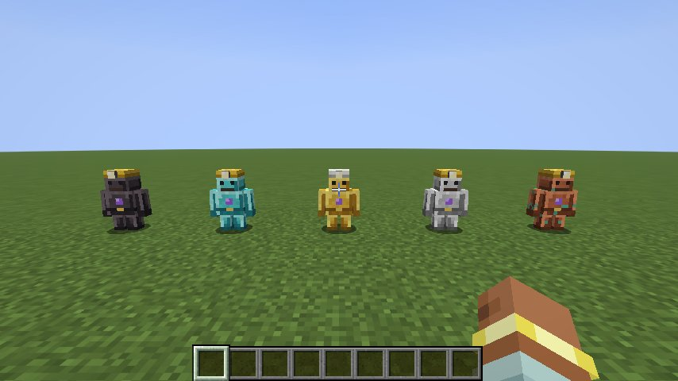
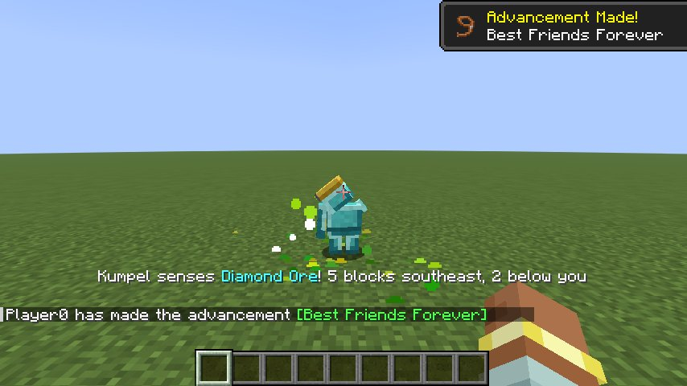
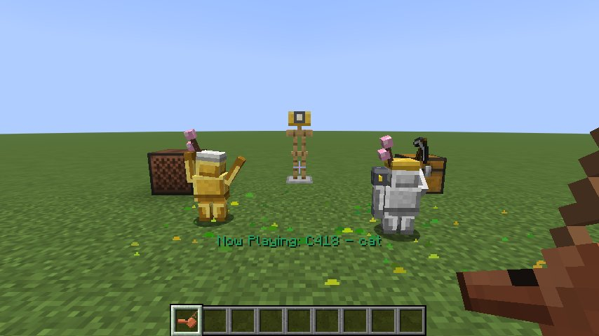

# Kumpel ⛏️

*Glück auf!* A small mining golem that keeps you company underground.
Your Kumpel follows you, picks up loot, senses ores, lights up dark tunnels, warns you about creepers and grows from copper to netherite the more you work together. Give it a pickaxe and it mines for you; give your crew a whistle and a chest and you have your own little colliery.

**Minecraft 26.3 · Fabric Loader ≥ 0.19.5 · Fabric API · Java 25** · optional: JEI or REI



## Getting started

Craft a **Kumpel Core** and use it on a block, and your own Kumpel appears.

```
 . A .      A = Amethyst Shard
 C R C      C = Copper Ingot
 C C C      R = Redstone Dust
```

A Kumpel spawned another way (e.g. `/summon kumpel:kumpel`) can be tamed with a copper ingot.
Everything the mod adds is in its own **Kumpel** creative tab.

## What your Kumpel does

| | |
|---|---|
| **Follows you** | Keeps close and teleports to you if it falls behind. Never takes fall damage, never drowns. |
| **Collects loot** | Picks up dropped items near you and brings them to you (or to its storage chest). Items *you* throw away are left alone. |
| **Senses ores** | Scans the area around it every few seconds. When it finds ore it points at it, rings a chime and tells you what it found, how far away it is and in which direction. Higher levels sense further and find rarer ores. |
| **Levels up** | Collecting items, finding and mining ores and being fed earns XP. Every level brings more health, a bigger backpack and a new look. |
| **Kiepe** (backpack) | Sneak + right-click opens its backpack: 1 row at copper, 3 rows at netherite. |
| **Grubenlampe** | Give it torches and it places them in dark spots underground. |
| **Schlagwetter warning** | Creepers near you start glowing (through walls) and your Kumpel warns you. It also warns you before you step next to lava. |
| **Henkelmann** | It keeps one stack of food from its loot and hands you a bite when you are getting hungry. |
| **Feierabend** | When you go to bed, your Kumpels sit down; in the morning they get back to work. |
| **Hauer** | Give it a pickaxe (right-click) and it mines exposed ores near you. The pickaxe's tier and enchantments count (Fortune, Silk Touch) and it wears down. Open its backpack to take the pickaxe back. |
| **Wünschelrute** | From level 4 (diamond) on, a sensed ore glows through the rock for a few seconds. |
| **Steigerlied** | It dances while a jukebox is playing nearby. |
| **Barbaratag** | On 4 December, Saint Barbara's Day, Kumpels wear a flowering branch and feeding them gives double XP. |
| **Vortrieb** | Sneak-use the whistle on a wall and the nearest Kumpel with a pickaxe digs a 1×2 tunnel into it (24 blocks by default). It stops before water, lava, drops and blocks its pickaxe can't break, puts what it digs into its backpack and lights the tunnel with its torches. |
| **Feldschmiede** | Give it a **field forge** and it smelts raw ores from its backpack into ingots, burning coal from its backpack. |
| **Silverfish warning** | While sensing ores it also notices infested stone, marks it red and tells you. |
| **Character** | Every new Kumpel gets a name from the Pott (Jupp, Kalle, Trude, Stani, Mehmet …), says something now and then and cheers when it finds treasure. |
| **Kanarienvogel** | Give it a **canary cage** and it carries a canary on its shoulder, like miners did. The canary makes monsters near you glow, warns you about them and about running out of air underwater, and lets your Kumpel notice creepers from further away. |
| **Its core survives** | If a Kumpel dies, it leaves a **cracked core** with its name and 80 % of its XP. Repair it with a copper block in a crafting table and use it to bring your Kumpel back. |





## Controls

| Action | Effect |
|---|---|
| Right-click (empty hand) | Sit / follow |
| Sneak + right-click (empty hand) | Open its backpack; the title shows its level, XP and health |
| Right-click with a copper ingot | Repair 5 health (at full health it is eaten for XP) |
| Right-click with ores, metals or gems | Feed it for XP (coal 1 … diamond 40, netherite ingot 300) |
| Right-click with torches | Put them into its backpack for the Grubenlampe |
| Right-click with a pickaxe | Hand it over for Hauer mode (swaps with the one it holds) |
| Right-click with a compass | Turn ore sensing on/off |
| Right-click with a canary cage | Put the canary on its shoulder |
| Right-click with a field forge | Strap the forge to its back |
| Sneak + right-click with an empty Kumpel Core | Pack your Kumpel into the core, e.g. to move it or take it through a portal. It keeps all its XP. |

## Steigerpfeife (Foreman's Whistle)

```
 C C N      C = Copper Ingot, N = Iron Nugget
```

| Use | Effect |
|---|---|
| Right-click | All your Kumpels within 64 blocks stand up and come to you |
| Sneak + right-click | All your Kumpels take a break and sit down |
| Sneak + right-click on the side of a block | **Vortrieb**: the nearest Kumpel with a pickaxe digs a tunnel into that wall, starting at your feet's height |
| Sneak + right-click on a container | It becomes their **storage chest**: they bring their loot there instead of to you. Works with anything that supports the Fabric Transfer API, so modded storage works too. Do it again to undo it. |

If the storage chest is full or out of reach, the Kumpel brings its loot to you and tries the chest again later.

## More items

| Item | Recipe | |
|---|---|---|
| **Canary Cage** | Iron Bars + Feather + Yellow Dye (shapeless) | For your Kumpel's shoulder, see above. Packing the Kumpel gives the cage back. |
| **Field Forge** | `S . S` / `C F C` (S = String, C = Copper Ingot, F = Furnace) | For your Kumpel's back, see above. Packing the Kumpel gives it back. |
| **Grubenhelm** (Miner's Helmet) | `C T C` / `C . C` (C = Copper Ingot, T = Torch) | A helmet with a lamp: wear it in the dark and you can see. Repaired with copper ingots. |

## Levels

| Level | Look | XP | Health | Sense radius | Backpack | Can sense |
|---|---|---|---|---|---|---|
| 1 | Copper | 0 | 20 | 8 | 1 row | coal, copper |
| 2 | Iron | 60 | 30 | 11 | 1 row | + quartz, iron, redstone |
| 3 | Gold | 180 | 40 | 14 | 2 rows | + lapis, gold, unlisted modded ores |
| 4 | Diamond | 400 | 50 | 17 | 2 rows | + emerald, diamond · Wünschelrute |
| 5 | Netherite | 800 | 60 | 20 | 3 rows | + ancient debris · fire immune |

All of this can be changed in the config.

## Configuration

The config lives in `config/kumpel.json` and is created on first start. Edit it and run **`/kumpel reload`** (operators only) to apply the changes without restarting. Existing Kumpels update to the new levels right away. If the file is broken, the mod logs an error and keeps using the defaults without touching your file.

### Levels (`tiers`)

Add, remove or change levels freely. They are sorted by `experience`; the first one is where every new Kumpel starts.

```json
{
  "name": "emerald",
  "experience": 1200,
  "max_health": 70.0,
  "movement_speed": 0.32,
  "sense_radius": 24,
  "collect_radius": 16,
  "pocket_rows": 4,
  "fire_immune": true,
  "texture": "kumpel:textures/entity/kumpel/diamond.png"
}
```

`texture` can point to any texture in a resource pack. A level's display name comes from the language key `kumpel.tier.<name>`; without one, the name itself is shown.

### Ores (`ores` and `unlisted_ores`)

Each entry maps a block tag or a single block to the level that can sense it. `value` decides which ore wins when several are in range, and `pitch` sets the chime.

```json
{ "tag": "c:ores/tin", "level": 2, "value": 22, "pitch": 0.95 },
{ "block": "create:zinc_ore", "level": 2, "value": 22 }
```

Ores from other mods that are in the conventional `c:ores` tag but not listed are picked up by `unlisted_ores` (level 3 by default), so modpacks work without any setup. List them to put them on the right level.

### Food (`feeding`)

Which items give how much XP, by `item` or by item `tag`.

### Behaviour (`behaviour`)

| Option | Default | |
|---|---|---|
| `repair_item`, `repair_amount` | copper ingot, 5 | What repairs a Kumpel and by how much |
| `experience_per_pickup` | 1 | XP per item stack picked up |
| `sense_interval_ticks` | 40 | Ticks between two ore scans |
| `announce_cooldown_ticks`, `same_ore_cooldown_ticks` | 300, 2400 | How often it may announce ores |
| `deliver_delay_ticks` | 80 | How long it waits after its last pickup before delivering |
| `max_collect_distance_from_owner` | 16 | Items further away from you are left alone |
| `death_experience_kept` | 0.8 | Share of XP kept in the cracked core |
| `place_torches`, `torch_light_level`, `torch_items` | on, 7, torches | Grubenlampe |
| `creeper_warning`, `creeper_warning_radius`, `lava_warning` | on, 10, on | Schlagwetter warning |
| `share_food`, `share_food_at_hunger` | on, 6 | Henkelmann |
| `rest_when_owner_sleeps` | on | Feierabend |
| `whistle_range` | 64 | How far your Kumpels hear the whistle |
| `storage_chests`, `max_storage_distance` | on, 48 | Lagerkiste |
| `mine_ores`, `mine_radius`, `experience_per_ore_mined` | on, 6, 2 | Hauer mode (also needs the `mobGriefing` game rule) |
| `dowsing_level`, `dowsing_glow_ticks` | 4, 100 | Wünschelrute (`0` turns it off) |
| `dance_to_jukebox` | on | Steigerlied |
| `barbara_day` | on | Barbaratag |
| `miner_helmet_lamp` | on | The Grubenhelm's lamp |
| `give_names` | on | New Kumpels get a name from the `names` list (top level of the config) |
| `chatter`, `chatter_interval_ticks` | on, 6000 | Remarks now and then, and cheers for treasure |
| `silverfish_warning` | on | Mark infested stone |
| `tunnels`, `tunnel_length` | on, 24 | Vortrieb (also needs the `mobGriefing` game rule) |
| `field_forge`, `smelt_ticks`, `smelt_tags` | on, 100, `c:raw_materials` + `c:ores` | What the field forge smelts and how fast |

### Commands

| Command | |
|---|---|
| `/kumpel reload` | Reloads the config (operators) |
| `/kumpel levels` | Lists all levels |
| `/kumpel ores` | Lists which ores are sensed from which level |
| `/kumpel list [player]` | Lists your loaded Kumpels with their level, position and what they are doing (another player's: operators) |

## Compatibility

- **JEI** and **REI**: info pages for the core, the whistle, the canary cage and the Grubenhelm, plus two categories: *Feeding a Kumpel* (item → XP) and *Ore sensing* (ore → level). Both are built from the config, so they show your modpack's setup.
- **Modded ores** are found through the `c:ores` tags, **modded storage** through the Fabric Transfer API.
- **Languages**: English, German, Polish, Turkish, Dutch, French and Spanish.

## Advancements

Glück auf! · Back Again · A Place for Everything · Hewer · At the Coal Face · Smelting Works · End of Shift · Here Comes the Foreman · Early Warning · Full Crew · From Copper to Netherite · and a hidden one for 4 December.

## Building

```sh
cd kumpel
./gradlew build
```

The jar ends up in `kumpel/build/libs/`. Every push also builds the mod on GitHub Actions; you can download the jar from the run's **Artifacts**.

### Tests

- **Server game tests** (`src/gametest`) run as part of `./gradlew build`. They cover the config defaults, collecting, ore sensing per level, levelling up, the backpack, delivering, packing and dying, torches, creeper warnings, food sharing, the whistle, storage chests, mining, tunnels (and stopping before water), the field forge, names, the silverfish warning, dancing, the Wünschelrute, Barbaratag, the canary, the Grubenhelm, that every language has every text and that all advancements load.
- **Client game test** (`./gradlew runClientGameTest`) starts a real client with JEI and takes screenshots of every level, the sitting pose, a Kumpel sensing buried diamond ore, and the Zeche: a Hauer with pickaxe and canary, a dancing Kumpel and the Grubenhelm, all on Barbaratag. On CI the screenshots are uploaded as an artifact.

## License

[MIT](LICENSE)
