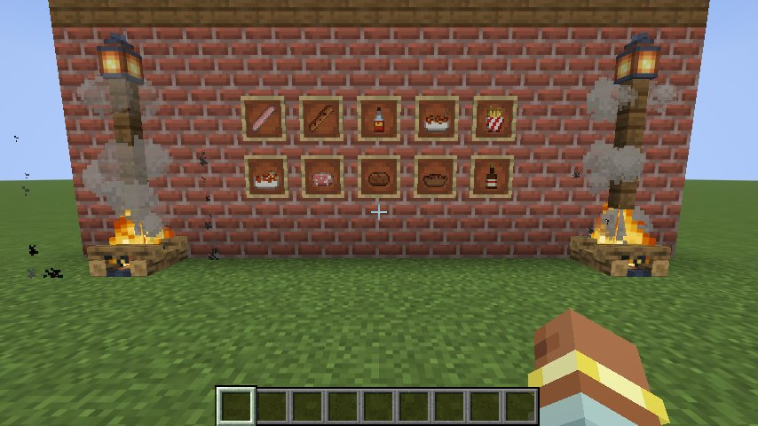

# Pottküche 🍟

*Glück auf, und guten Hunger!* Food from the Ruhr, the way it's served at the Bude round the corner from the pit: Currywurst and Pommes, Frikadellen, Pfefferpotthast and a bottle of Malzbier.

A companion to [Kumpel](../kumpel/): its dishes are among the Kumpels' favourite foods. It works on its own, too.

**Minecraft 26.3 · Fabric Loader ≥ 0.19.5 · Fabric API · Java 25**



## Food

Everything is in its own **Pottküche** creative tab and in *Food & Drinks*.

| Dish | Hunger | How to make it |
| --- | --- | --- |
| **Rohe Bratwurst** (Raw Bratwurst) | 2 | a raw porkchop → 2 |
| **Bratwurst** | 5 | cook a raw Bratwurst in a furnace, smoker or on a campfire |
| **Currysoße** (Curry Sauce) | – | 2 beetroots, sugar and a glass bottle. Only an ingredient; the bottle comes back when you cook with it. |
| **Currywurst** | 8 | a Bratwurst and Currysoße. Makes you quick (Speed) for a minute. |
| **Pommes** | 6 | 2 baked potatoes and paper |
| **Currywurst-Pommes** | 13 | a Currywurst and Pommes. Speed for two minutes. |
| **Rohe Frikadelle** (Raw Frikadelle) | 2 | raw beef, bread and an egg → 3 |
| **Frikadelle** | 6 | cook a raw Frikadelle |
| **Pfefferpotthast** | 10 | a bowl, cooked beef, a potato and a carrot. The Westphalian beef stew; you get the bowl back. |
| **Malzbier** (Malt Beer) | 2 | a glass bottle, 2 wheat and sugar. Dark, sweet, without alcohol, and it heals a little. |

## Languages

English, German, Polish, Turkish, Dutch, French and Spanish.

## Building

```sh
./gradlew build
```

The jar ends up in `build/libs/`. `build` also runs the game tests (`src/gametest`): every dish is food (and the sauce isn't), Currywurst fills you up and makes you quick, stew and Malzbier give their bowl and bottle back, the sauce bottle stays behind when you cook, a Bratwurst cooks in a furnace, every recipe loads and every language has every name.

`./gradlew runClientGameTest` builds the Bude in the picture above in a real client and takes the screenshot.

## License

MIT
