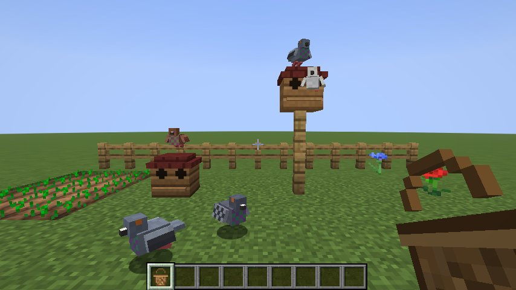

# Taubenschlag 🕊️

*Glück auf!* In the Ruhr, a miner's pigeons were "the racehorse of the little man": kept in a loft on the allotment, driven out in baskets on Sunday morning and timed on their way home. This mod brings them into Minecraft.

A companion to [Kumpel](../kumpel/), [Zechenbau](../zechenbau/) and [Pottküche](../pottkueche/). It works on its own, too.

**Minecraft 26.3 · Fabric Loader ≥ 0.19.5 · Fabric API · Java 25**



## Homing pigeons

| | |
| --- | --- |
| **Wild pigeons** | Live in small flocks on plains, sunflower plains and meadows, in four plumages: *Blau* (blue bar), *Gehämmert* (chequer), *Rot* (red) and *Weiß* (white). They glide down instead of falling and never take fall damage. |
| **Taming** | Feed a wild pigeon seeds (wheat, beetroot, melon, pumpkin or torchflower); one in three does it. A tame pigeon gets a ring with its own number, like `DV-04711-26-123`, and is called by it until you give it a name. |
| **Its loft** | A tame pigeon without a home follows you, like a parrot. Bring it within 8 blocks of a **Taubenschlag** and it settles in there. From then on it stays around its loft, and if the loft is broken, it forgets it and looks for a new one. |
| **Sitting** | Right-click your pigeon with an empty hand: it waits where it is, or is free again. |
| **Auflassen** | Sneak and right-click your pigeon: it flies home to its loft. Hold something while you do it and it carries that along as post. |
| **The flight home** | The pigeon leaves and turns up at its loft once it has covered the distance, at about 18 blocks per second, a little faster or slower depending on its form on the day, and a little faster with every flight it has made (up to 30). It keeps flying while nobody is near; if the loft is not loaded when it arrives, it lands as soon as it is. You get told how far it flew, how long it took and how fast it was, with a note when it beat its own best. |
| **Post** | What the pigeon carries goes into the loft's nine nest boxes, onto stacks of the same kind first. If they are full, the rest lies in front of the loft. A comparator next to the loft shows how full it is. |
| **Homesick** | Let out more than 32 blocks from its loft (and not told to sit), a pigeon flies home by itself after half a minute. |
| **Young birds** | Feed two tame pigeons seeds and they breed. The young bird has the plumage of one of its parents, its own ring, and belongs to you. Seeds also heal a hurt pigeon. |

## Blocks and items

Everything is in its own **Taubenschlag** creative tab, too.

| | |
| --- | --- |
| **Taubenschlag** (Pigeon Loft) | A little wooden house with a landing board. Right-click it to see the post. Made from 3 wooden slabs, 4 planks, a wooden trapdoor and wheat seeds. |
| **Reisekorb** (Travel Basket) | Right-click your tame pigeon to put it in; the tooltip shows its name, ring, plumage, loft and flights. Use the basket on the ground to let the pigeon out there, or **in the air** to let it fly straight home, carrying whatever is in your other hand. **Sneak** and use it on a loft and the pigeon settles in there instead. Made from string, 2 sticks and 3 wheat. |
| **Brieftauben-Spawn-Ei** | A wild pigeon, for creative mode. |

## Advancements

*Taubenschlag* (build a loft), *Rennpferd des kleinen Mannes* (tame a pigeon), *Heimatschlag* (a pigeon settles in), *Luftpost* (a pigeon brings post home), *Preisflug* (a pigeon flies home from 1000 blocks away) and *Jungtaube* (breed two pigeons).

## Languages

English, German, Polish, Turkish, Dutch, French and Spanish.

## Building

```sh
./gradlew build
```

The jar ends up in `build/libs/`. `build` also runs the game tests (`src/gametest`): seeds tame a wild pigeon and it gets a ring, tame pigeons settle into a loft nearby and forget one that is gone, a pigeon let go carries its post home into the loft (or in front of it, when the loft is full), a pigeon without a loft stays put, the travel basket keeps everything about its pigeon and settles it into a new loft, strangers' and wild pigeons stay out of your basket, young birds belong to the owner, longer flights take longer, a loft signals comparators and drops its post when broken, pigeons take no fall damage, every advancement loads and every language has every text.

`./gradlew runClientGameTest` builds the allotment in the picture above in a real client and takes the screenshot.

## License

MIT
