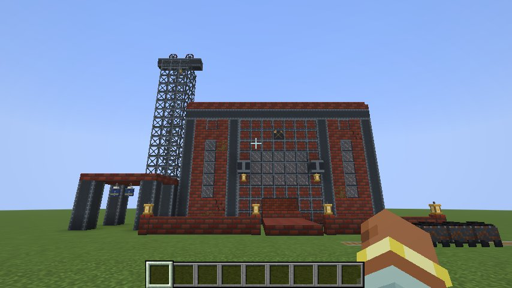
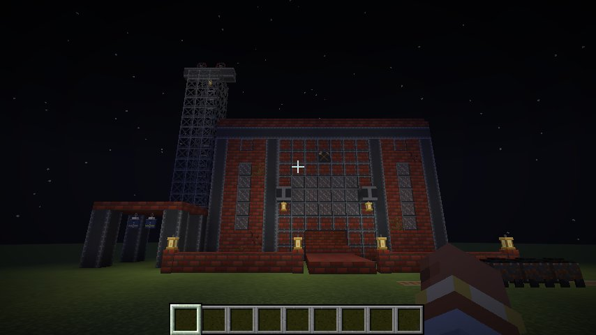

# Zechenbau 🏭

*Glück auf!* Building blocks of the Ruhr's collieries: red colliery bricks, the steel framework of Zeche Zollverein, girders, headframe lattice and miner's lamps. Build your own pithead, machine hall or workers' settlement.

A companion to [Kumpel](../kumpel/), but it works on its own.

**Minecraft 26.3 · Fabric Loader ≥ 0.19.5 · Fabric API · Java 25**



## Blocks

Everything is in its own **Zechenbau** creative tab and in *Building Blocks*.

| Block | Recipe |
| --- | --- |
| **Zechenziegel** (Colliery Bricks) | 2 bricks + 2 coal, diagonally → 4 |
| **Zechenziegeltreppe, -stufe, -mauer** (stairs, slab, wall) | the usual shapes, or the stonecutter |
| **Rissige Zechenziegel** (Cracked Colliery Bricks) | Zechenziegel in a furnace |
| **Bemooste Zechenziegel** (Mossy Colliery Bricks) | a Zechenziegel with vines or a moss block. For the Industriekultur look, where nature takes the old pits back. |
| **Stahlfachwerk** (Steel-Framed Bricks) | 2 iron ingots + 2 Zechenziegel, diagonally → 4 |
| **Fachwerkfenster** (Steel-Framed Window) | 2 iron ingots + 2 glass, diagonally → 4 |
| **Stahlträger** (Steel Girder) | 3 iron ingots in a column → 3. Place it upright or on its side, like a log. |
| **Fördergerüst** (Headframe Lattice) | 5 iron ingots in an X → 8. You can see through it. |
| **Grubenlampe** (Miner's Lamp) | copper ingot, glass panes and a torch. Stands or hangs like a lantern and shines brightly. |
| **Seilscheibe** (Sheave Wheel) | 4 iron ingots around a Stahlträger. The big wheel on top of the headframe; you can see through its spokes. |
| **Hunt** (Coal Tub) | a minecart and a block of coal. A mine tub heaped with coal, for the yard or the track. |
| **Kauenhaken** (Pithead Bath Hanger) | 2 iron nuggets above blue wool. In the Waschkaue, miners hung their clothes on hooks and pulled them up to the ceiling on chains. |
| **Schlägel und Eisen** (Hammer and Pick Tile) | a Zechenziegel in the stonecutter. The miners' sign, for above the gate. |

All of them are mined with a pickaxe. Seilscheibe, Hunt and Kauenhaken turn to face you when you place them.



## Languages

English, German, Polish, Turkish, Dutch, French and Spanish: the languages of the Ruhr's miners.

## Building

```sh
./gradlew build
```

The jar ends up in `build/libs/`. `build` also runs the game tests (`src/gametest`): every block has an item, drops itself, needs a pickaxe and has a name in every language; every recipe loads; the lamp hangs from a girder; the decorative blocks turn their shape with them.

`./gradlew runClientGameTest` builds the colliery in the pictures above in a real client and takes the screenshots.

## License

MIT
